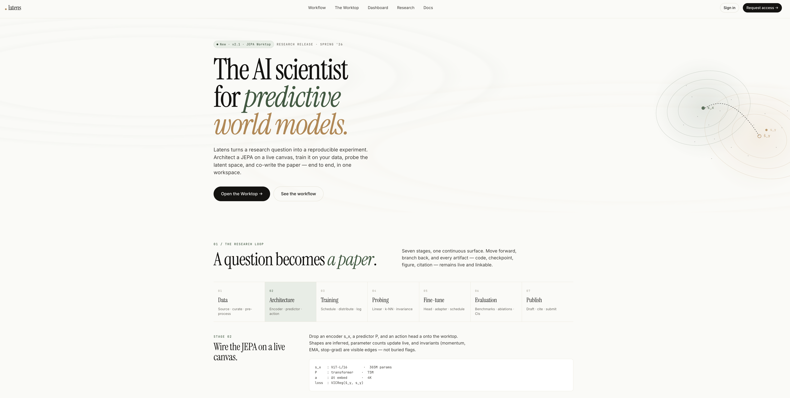
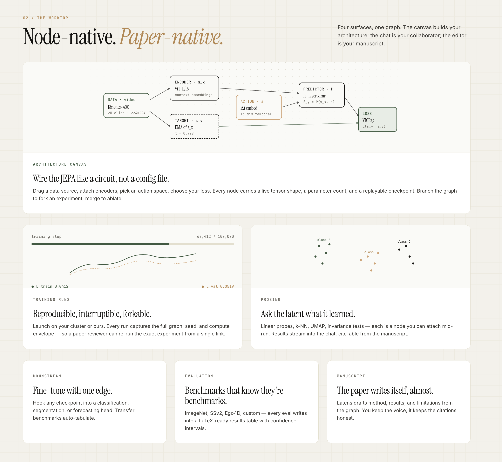
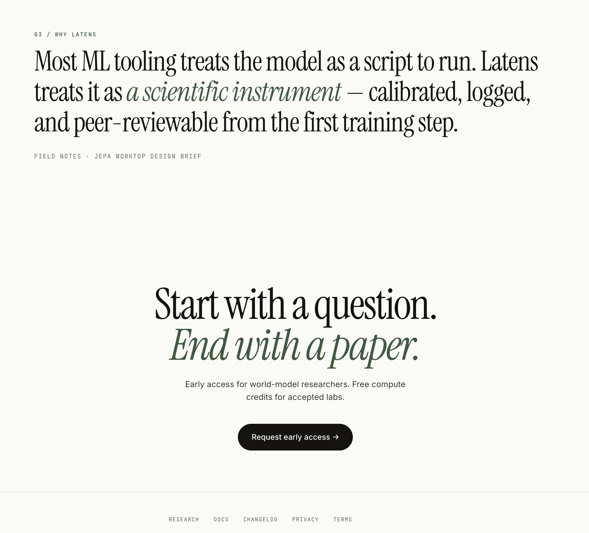

# Latens — World Model Lab

> **The AI scientist for predictive world models.**
> Latens turns a research question into a reproducible experiment.
> Architect a JEPA on a live canvas, train it on your data, probe the latent space, and co-write the paper — end to end, in one workspace.

This repository is the **public project page**: README, design assets, and example specs.
It is intentionally **source-free** — the implementation lives in a separate repo and evolves independently of this introduction.

---

## The research loop

Seven stages, one continuous surface. Move forward, branch back, and every artifact — code, checkpoint, figure, citation — remains live and linkable.

| # | Stage         | What you do                                       |
| - | ------------- | ------------------------------------------------- |
| 1 | Data          | Source · curate · pre-process                     |
| 2 | Architecture  | Encoder · predictor · action                      |
| 3 | Training      | Schedule · distribute · log                       |
| 4 | Probing       | Linear · k-NN · invariance                        |
| 5 | Fine-tune     | Head · adapter · schedule                         |
| 6 | Evaluation    | Benchmarks · ablations · CIs                      |
| 7 | Publish       | Draft · cite · submit                             |

---

## The Worktop

Four surfaces, one graph. The canvas builds your architecture; the chat is your collaborator; the editor is your manuscript.

- **Architecture canvas** — wire the JEPA like a circuit, not a config file. Drag a data source, attach encoders, pick an action space, choose your loss. Every node carries a live tensor shape, a parameter count, and a replayable checkpoint. Branch the graph to fork an experiment; merge to ablate.
- **Training runs** — reproducible, interruptible, forkable. Launch on your cluster or ours. Every run captures the full graph, seed, and compute envelope — so a paper reviewer can re-run the exact experiment from a single link.
- **Probing** — ask the latent what it learned. Linear probes, k-NN, UMAP, invariance tests — each is a node you can attach mid-run. Results stream into the chat, citeable from the manuscript.
- **Downstream** — fine-tune with one edge. Hook any checkpoint into a classification, segmentation, or forecasting head. Transfer benchmarks auto-tabulate.
- **Evaluation** — benchmarks that know they're benchmarks. ImageNet, SSv2, Ego4D, custom — every eval writes into a LaTeX-ready results table with confidence intervals.
- **Manuscript** — the paper writes itself, almost. Latens drafts method, results, and limitations from the graph. You keep the voice; it keeps the citations honest.

---

## Why Latens

Most ML tooling treats the model as a script to run. Latens treats it as **a scientific instrument** — calibrated, logged, and peer-reviewable from the first training step.

> *Start with a question. End with a paper.*

---

## Examples

| File                                                   | What it shows                                          |
| ------------------------------------------------------ | ------------------------------------------------------ |
| [`examples/session.md`](examples/session.md)           | Shape of a "world session" manifest                    |
| [`examples/rollout.md`](examples/rollout.md)           | A latent rollout trace and how to interpret it         |
| [`examples/architecture.md`](examples/architecture.md) | Long-form description of the JEPA worktop components   |

---

## Status

This is a **public scaffold** — a stable, link-friendly home for the project's introduction, design assets, and example specs. The implementation evolves in a separate repository and is not vendored here.

Early access is open for world-model researchers; accepted labs receive free compute credits.

---

## Roadmap (rough)

- [ ] First example session manifest from a real Worktop run
- [ ] "Two rollouts side-by-side" comparison view
- [ ] Public checkpoints for the v2.1 JEPA Worktop release

---

## License

TBD — until a license is added, treat the contents of this repo as "all rights reserved" by the authors.
