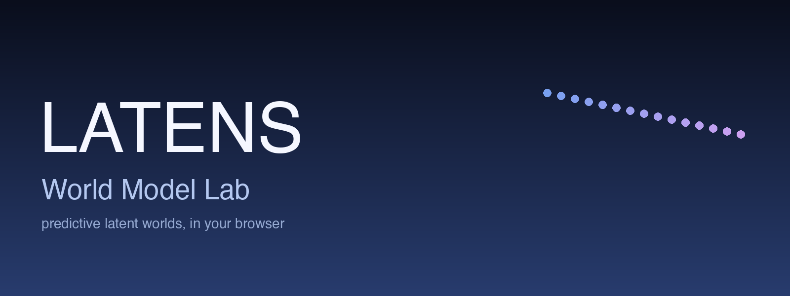
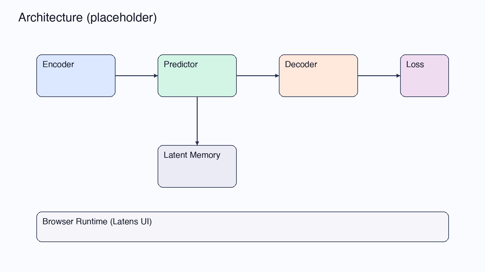
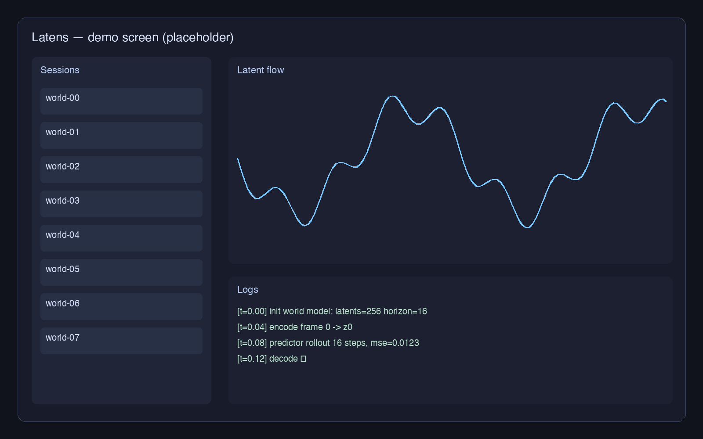

# Latens — World Model Lab

> A research scaffold for building, inspecting, and replaying **predictive latent world models** in the browser.
> This repository is intentionally **source-free**: it holds the project's narrative, design assets, and example specs.
> Implementation lives in downstream forks (e.g. the Latens frontend inside `SN-EBM/muse-web/src/latens/`).

---

## What is Latens?

Latens is a small research-grade workbench for **world models**: systems that learn a compressed latent representation of a stream (video, sensor traces, agent rollouts) and predict its future. The lab centers on three things:

1. **Encoders** that map raw observations into a low-dimensional latent space.
2. **Predictors** that roll the latent forward in time without ever decoding back to pixels.
3. **A browser UI** for stepping through, branching, and comparing rollouts side-by-side.

The repo you're looking at is the *project page* — design notes, diagrams, and example session manifests. It is the public face of the work; the implementation is intentionally not vendored here.

---

## Architecture (sketch)

| Block          | Role                                                                |
| -------------- | ------------------------------------------------------------------- |
| Encoder        | Observation → latent vector `z_t`                                   |
| Predictor      | `z_t → ẑ_{t+1}` (autoregressive rollout, no pixel reconstruction)   |
| Decoder        | Optional — only for visualization / debugging                       |
| Latent Memory  | Versioned store of latents, rollouts, and forks                     |
| Browser UI     | Latens app — sessions, latent flow, logs                            |

See [`examples/architecture.md`](examples/architecture.md) for the longer-form description and the open questions.

---

## Screens

A placeholder for the Latens UI: left rail is sessions, top-right is the latent flow chart, bottom-right is the streaming log. Real screenshots will replace this image once the UI ships in the downstream repo.

---

## Examples

| File                                             | What it shows                                          |
| ------------------------------------------------ | ------------------------------------------------------ |
| [`examples/session.md`](examples/session.md)     | Shape of a "world session" manifest                    |
| [`examples/rollout.md`](examples/rollout.md)     | A latent rollout trace and how to interpret it         |
| [`examples/architecture.md`](examples/architecture.md) | Long-form description of the components above   |

---

## Status

This is a **public scaffold**. There is no executable code in this repo on purpose — the goal is to host the project's introduction, diagrams, and example specs in a stable, link-friendly place while implementation evolves elsewhere.

If you arrived here looking for code: check the issues tab for pointers to the active implementation repo.

---

## Roadmap (rough)

- [ ] Replace placeholder banner with the final hero artwork
- [ ] Replace `architecture.png` with a vector diagram exported from the design source
- [ ] Add real screenshots once the Latens UI ships
- [ ] Publish the first example session manifest from a real run

---

## License

TBD — until a license is added, treat the contents of this repo as "all rights reserved" by the authors.
